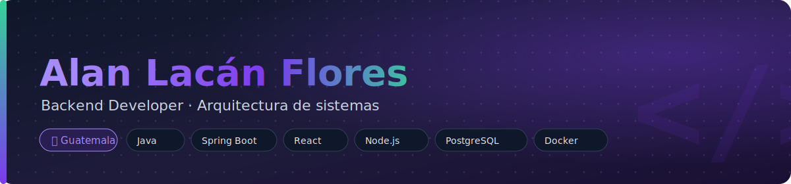
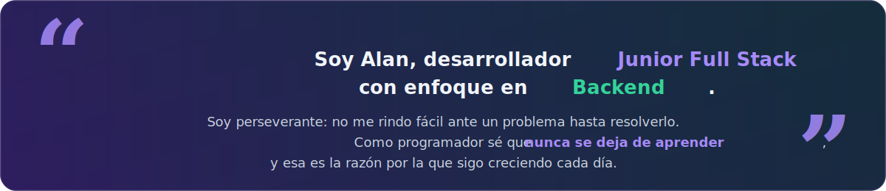
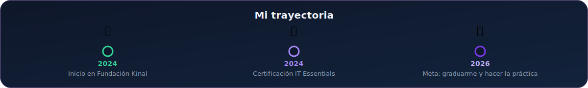
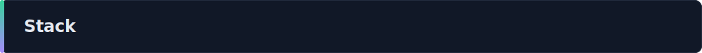
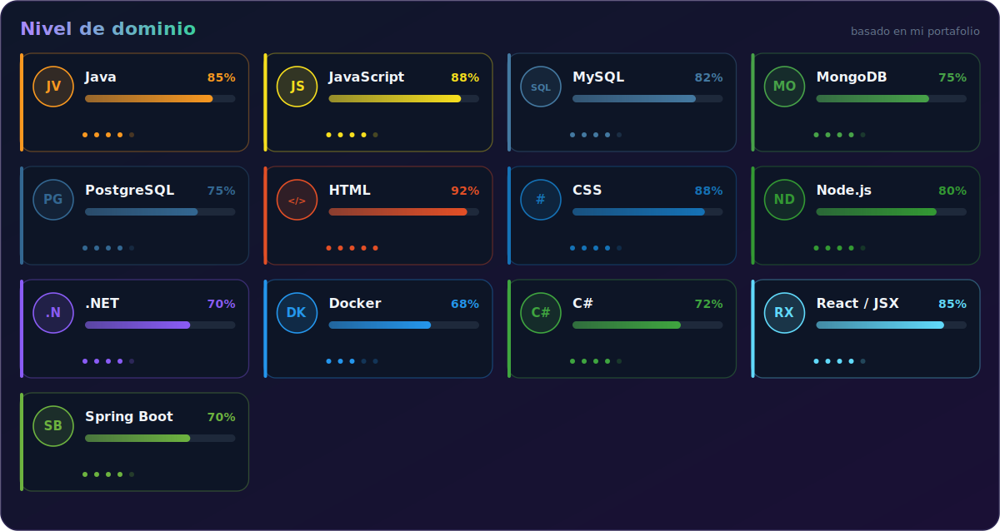
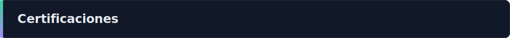
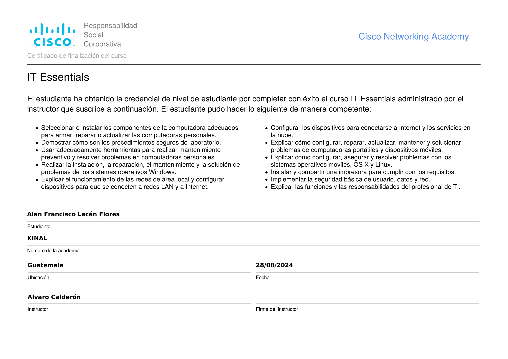
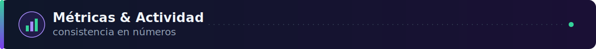

  

 

 

Estudiante de **Perito en Informática** en Fundación Kinal, enfocado en entender el sistema completo: interfaces en React, servicios en Node.js/Spring Boot, y los datos que los sostienen en PostgreSQL y MongoDB. Aprendiendo constantemente Docker y buenas prácticas de arquitectura, con la mira puesta en la práctica supervisada 2026 en **EMPAGUA**.

 

  

 

**Cliente** &nbsp;·&nbsp; interfaz
 

  

**Servidor** &nbsp;·&nbsp; servicios
 

  

**Datos** &nbsp;·&nbsp; persistencia
 

  

**Taller** &nbsp;·&nbsp; herramientas
 

  

  

 

<table width="100%">
<tr>
<td width="50%" valign="top">
<table width="100%">
<tr>
<td width="72" valign="top"></td>
<td valign="top">

**KinalBank** &nbsp;
 
Sistema bancario con gestión de cuentas y transacciones, manejo de roles y persistencia relacional/no relacional trabajando en conjunto.
  
   
  
**[→ Ver repositorio](https://github.com/alacan-2024010)**

</td>
</tr>
</table>
</td>
<td width="50%" valign="top">
<table width="100%">
<tr>
<td width="72" valign="top"></td>
<td valign="top">

**KinalGourmetHouse** &nbsp;
 
Plataforma de pedidos y administración para restaurante, con API REST propia y separación clara entre cliente, servidor y capa de datos.
  
   
  
**[→ Ver repositorio](https://github.com/alacan-2024010)**

</td>
</tr>
</table>
</td>
</tr>
<tr><td colspan="2" height="20"></td></tr>
<tr>
<td width="50%" valign="top">
<table width="100%">
<tr>
<td width="72" valign="top"></td>
<td valign="top">

**EcoApp** &nbsp;
 
Aplicación orientada a sostenibilidad y hábitos eco-friendly, con foco en experiencia de usuario y datos persistentes.
  
   
  
**[→ Ver repositorio](https://github.com/alacan-2024010)**

</td>
</tr>
</table>
</td>
<td width="50%" valign="top">
<table width="100%">
<tr>
<td width="72" valign="top"></td>
<td valign="top">

**Huellitas S.A.** &nbsp;
 
Sistema de gestión de escritorio con generación de reportes dinámicos, enfocado en persistencia y documentos exportables.
  
  
  
**[→ Ver repositorio](https://github.com/alacan-2024010)**

</td>
</tr>
</table>
</td>
</tr>
</table>

  

 

### IT Essentials: PC Hardware and Software

Cisco Networking Academy · Fundación Kinal · 28/08/2024

  

Certificación de nivel estudiante que valida competencias en selección e instalación de componentes de computadora, además de configuración de dispositivos para conexión a Internet y servicios en red.

 

 

📄 Clic en la imagen para ver el certificado completo en PDF

  

 

  

 

  

  

